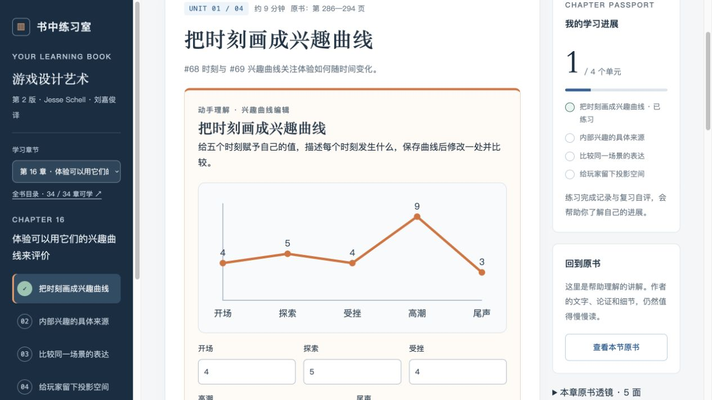

# 书中练习室 · Book to Play

把《游戏设计艺术》第 2 版的阅读变成小段理解、动手观察、记录结果和设计练习。当前包含 **34 章、136 个学习单元**；第 5—34 章使用 15 种工作台，每章至少两种互动形式。

关系图、排序、预算取舍、状态机、骰子抽样、资源轨迹、收益表、灯阵谜题、兴趣曲线、界面对照、地图寻路、配色场景、回忆任务、收入成本推算和作品编辑，分别回应章节主题。完成记录表示已操作并写下解释，开放答案和章节作品由学习者自评。



## 本地启动

需要 Node.js 18 或更高版本。应用没有 npm 依赖，无需 `npm install`。

```sh
cd chapter-one
npm start
```

打开 <http://127.0.0.1:4173/开始学习.html>。分文件入口为 <http://127.0.0.1:4173/index.html>。服务只监听本机；自定义端口可用 `PORT=4195 npm start`。

课程与互动可以直接运行。仓库不包含原书、扫描图片、OCR 全文或个人学习记录；未恢复图片时，“核对原书”窗口无法显示扫描页。现有本地工程的图片保持原样。

## 恢复本地原书图片

需要与课程页码对应的《游戏设计艺术》第 2 版扫描 PDF：638 页，正文为 PDF 第 49—594 页，书中页码为 PDF 页码减 48。其他排版或版本不能直接套用这些定位。

只在自己的电脑上操作。可在单独的 Python 环境中安装提取所需依赖，再指定本地 PDF：

```sh
# 在仓库根目录执行
python3 -m venv .venv
.venv/bin/python -m pip install pypdf Pillow
.venv/bin/python chapter-one/scripts/extract_source.py --source '/本地路径/游戏设计艺术.pdf' --list
# 核对目录和页码后，提取正文；已有图片会保留
.venv/bin/python chapter-one/scripts/extract_source.py --source '/本地路径/游戏设计艺术.pdf' --chapters 1-34 --pdf-end 594
```

图片生成至 `chapter-one/dist/assets/source/page-N.jpg`，由 `.gitignore` 排除。提取脚本适用于当前扫描版的内嵌图片；没有内嵌扫描图时会停止，需要另外在本地渲染 PDF。OCR 仅用于制作时检索，不是应用运行依赖。

## 存档与维护

笔记、实验结果和章节作品保存在当前浏览器的本地存储中。使用应用内 JSON 备份和 Markdown 导出留存；更换浏览器、协议或端口前先备份。旧版第一章及全书 v2 存档仍支持恢复。个人数据不自动上传 GitHub。

```sh
cd chapter-one
node scripts/sync-course-docs.mjs
npm run build
npm run check
```

编辑 `dist/` 中的模块源文件，构建后生成 `dist/开始学习.html`。完整检查包括原书扫描图片存在性，克隆后需先恢复本地图片，再运行 `npm run check`。当前本地工程 23 项自动检查通过；浏览器验证范围与限制见[验证记录](chapter-one/content/verification.md)。历史批量生成脚本已停用，不应重新启用来覆盖课程。

## 工程与接续

| 文件 | 用途 |
|---|---|
| [AGENTS.md](AGENTS.md) | 项目规则、个人数据与提交规范 |
| [制作工作流.md](制作工作流.md) | 制作思路、维护步骤和模型交接 |
| [全书课程总览](chapter-one/content/course-overview.md) | 34 章单元及透镜出处 |
| [当前制作状态](chapter-one/content/production-status.json) | 已完成范围、验证和下一步 |
| `chapter-one/dist/` | 静态应用、课程和工作台模块 |
| `chapter-one/tests/` | 互动行为、计算规则和存档兼容检查 |
| `chapter-one/scripts/` | 本地服务、构建、文档同步和来源提取 |

新模型接续前先读规则、工作流与状态，再按用户指定范围修改。当前已有 34 章，不存在待补齐的第 35 章。

本工程是重点概念的互动学习路线，未逐段替代原书；目前没有整书上传自动生成、模型评分或云同步。数值工作台有明确的教学假设，不预测真实玩家情绪、留存或销量。
